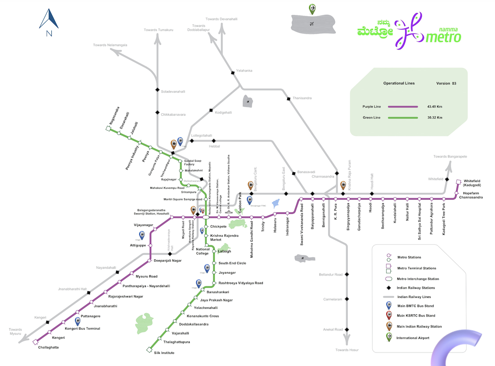

# Namma Metro Ridership Tracker 🚇
### Overview
The Bangalore Metro Rail Corporation Limited \(BMRCL\) publishes daily ridership data every 24 hours\. Unfortunately\, they do not provide historical data beyonf one day\. 
This repository contains a Python script and Jupyter Notebook to automate the process of downloading ridership data from BMRCL and storing it in a csv file\. As the dataset evolves over time\, it will allow for analysis of ridership and usage patterns\.

### Features
* **Dynamic Content Handling**\: Automates the Kannada\/English toggle button to retrieve data in English\.
* **CSV File Management**\: Automatically creates and appends data to a CSV file\, optimizing by removing duplicate entries\. \(This prevents duplication of data rows if\, for example\, the script is run multiple times a day\.\)
* **Error Handling**\: Includes checks for connectivity issues\, page load time\, and element availability\, thus ensuring robust performance when working with an Indian public service website\.
### Installation
1. Clone this repository\.
```shell
git clone https://github.com/your-username/namma-metro-ridership-tracker.git
cd Namma Metro-Ridership-Tracker
```
2. Install the required packages\.
Ensure you have Python 3\.8\+ and install dependencies\:
```shell
pip install -r requirements.txt
```
requirements\.txt includes **selenium** and **pandas**
### Usage
To collect the latest ridership data\, run\:
```shell
python ridership.py
```
The script will automatically check for an existing dataset file \(Namma Metro\_Ridership\_Dataset\.csv\) and append new entries\.
The repository includes a Jupyter Notebook that demonstrates the functionality step\-by\-step\. Open it with\:
```shell
jupyter notebook ridership.ipynb
```
### Project Structure
Namma Metro\-Ridership\-Tracker\/
├── Namma Metro\_Ridership\_Dataset\.csv
    \# Collected ridership dataset \(growing over time\)
├── ridership\.py                           
    \# Main Python script for scraping and storing data
├── ridership\.ipynb                        
    \# Jupyter Notebook for exploratory data analysis
├── requirements\.txt                       
    \# Required Python packages
└── README\.md                              
    \# Project documentation
### Dataset
**NammaMetro\_Ridership\_Dataset\.csv** is updated daily with each row representing a new day’s ridership statistics\. Columns include\:
*Record Date \| Total Smart Cards \| Stored Value Card \| One Day Pass \| Three Day Pass \| Five Day Pass \| Tokens \| Total NCMC \| Group Ticket \| Total QR \| QR NammaMetro \| QR WhatsApp \| QR Paytm*
This dataset is a valuable resource for anyone interested in transportation trends or urban studies\.
### Future Work
Planned features and improvements include\:
* Data Visualization\: Create plots to analyze trends in ridership\.
* Automated Scheduler\: Set up a CRON job to automate daily scraping\.
* Enhanced Error Logging\: Improve logging for failed attempts or missing data\.
* Other City Metros\: Metro corporations across India work in silos\; each one with its own format for published data\, if at all\. The plan is to be able to scrape \'em all\!
### License
This project is licensed under the **BSD Zero\-Clause License**\. See the LICENSE file for more details\.
