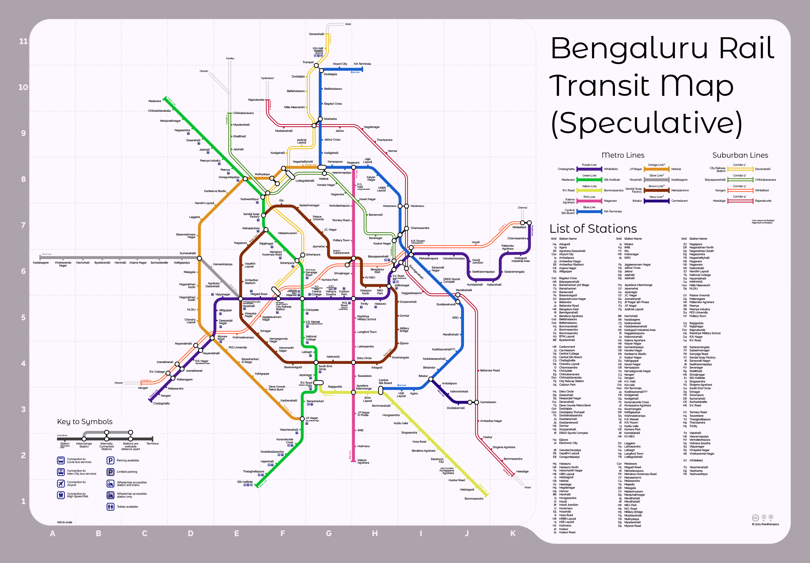

# Bengaluru NammaMetro Ridership Analysis 🚇

TLDR? Go straight to [NammaMetro Ridership Data Analysis & Visualisation](https://bit.ly/nammametro3) – a live rendering of `ridership_3analysis.ipynb`.

## Overview

The Bangalore Metro Rail Corporation Limited (BMRCL) publishes [daily ridership data](https://www.bmrc.co.in/ridership/) every 24 hours. Unfortunately, they do not provide historical data beyond one day. This GitHub repository contains scripts to automate the process of maintaining official ridership data from BMRCL. The growing dataset and its analysis (provided in Jupyter notebook format) opens a window of insight into the throbbing pulse of Bangalore.


[Source: TransitMaps.net](https://transitmap.net/fantasy-rail-bengaluru-theotherspica/) – Fantasy Map: A speculative rail transit map of Bengaluru, India © theotherspica

## Features

* **Dynamic Content Handling**: Toggles the Kannada/English button in headless browser mode to retrieve data from the [data source page](https://www.bmrc.co.in/ridership/).

* **CSV File Management**: Automatically creates, appends and maintains data in a CSV file. It optimizes the file by removing duplicate data rows if, for example, the script is run multiple times a day.

* **Error Handling**: Includes checks for connectivity issues, page load time\, and element availability, thus ensuring robust performance when working with an Indian public service website.

* **Script Automation**: Included cronjobs.sh with instructions to trigger ridership.py daily at specified times.

* **Advanced Data Analysis & Visualization**: The [included Jupyter notebook](https://bit.ly/nammametro3) provides a step-by-step analysis of the collected data.

## Dataset

**NammaMetro_Ridership_Dataset.csv** is updated daily with each row representing the previous day's ridership stats. BMRCL's Ridership page offers the following data points:

* `Record Date`

* `Total Smart Cards` (= `Stored Value Card` + `One Day Pass` + `Three Day Pass` + `Five Day Pass`)

* `Tokens`, `Total NCMC`, `Group Ticket`

* `Total QR` (= `QR NammaMetro` + `QR WhatsApp` + `QR Paytm`)

The first entry of this dataset was recorded on 2024-10-26. As the dataset grows, one day and one row at a time, it will become a valuable resource for anyone interested in transportation trends and urban studies.

## Installation

1. Clone this repository.

```shell
    git clone https://github.com/your-username/namma-metro-ridership-tracker.git

    cd Namma Metro-Ridership-Tracker
```

2. Install the required packages.

    Ensure you have Python 3.8+ and install dependencies:

```shell
    pip install -r requirements.txt
```

requirements.txt includes `selenium` and `pandas`

## Usage

To collect the latest ridership data, run:

```shell
    python ridership.py
```

The Python program will automatically check for an existing dataset file `Namma Metro_Ridership_Dataset.csv`, create one if necessary, and append the current day's data row. The Jupyter Notebook version `ridership.ipynb` does exactly what the program does but allows you to follow along step-by-step. Open it with:

```shell
    jupyter notebook ridership.ipynb
```

## Setup cronjob.sh (Optional)

The `cronjobs.sh` script automates the execution of `ridership.py` to collect daily ridership data from BMRCL at different times of the day. If the job is successful, it logs a timestamp to `cron_log.txt`. Otherwise, it appends the error output to a temporary folder.

The jobs run at 17:37 UTC, 20:52 UTC, and 01:23 UTC. Feel free to customise as needed. Scheduling multiple cron jobs in a 24-hour period increases the likelihood that data is captured every day. The program eliminates duplication of data in the dataset.

**Doable Danny** is a good place to [learn more about cron jobs](https://www.doabledanny.com/cron-jobs-on-mac).

## Project Structure

**namma-metro-ridership-tracker** (repo)

1. `README.md`

2. `LICENSE`

3. `requirements.txt` —— Required Python packages

4. `ridership.py` and `ridership_1data.ipynb` —— Program for downloading, storing and maintaining data in the dataset

5. `ridership_3analysis.ipynb` —— Jupyter Notebook for Data Analysis & Visualisation

6. `Namma Metro_Ridership_Dataset.csv` —— Collected ridership dataset (grows @ 1 row/day)

7. `cronjobs.sh` —— shell script to automatically run the program at a specific time

8. `/images` —— Folder containing images and photographs used in `ridership_3analysis.ipynb`

9. `significant_dates.csv` —— CSV file containing significant dates and events specific to Bangalore

## Future Work

Planned features and improvements include:

* ~~Advanced Data Analysis & Visualization: Create plots to analyze trends in ridership.~~ DONE!

* ~~Automated Scheduler: Set up a CRON job to automate daily scraping.~~ DONE!

* ~~Enhanced Error Handling and Logging: Failed attempts and missing data should break elegantly and be logged.~~ DONE!

* Other City Metros: Metro corporations across India work in silos\; each one with its own format for published data, if at all. One script to scrape 'em all!

## License

This project is licensed under the **BSD Zero-Clause License**. See the LICENSE file for more details.
